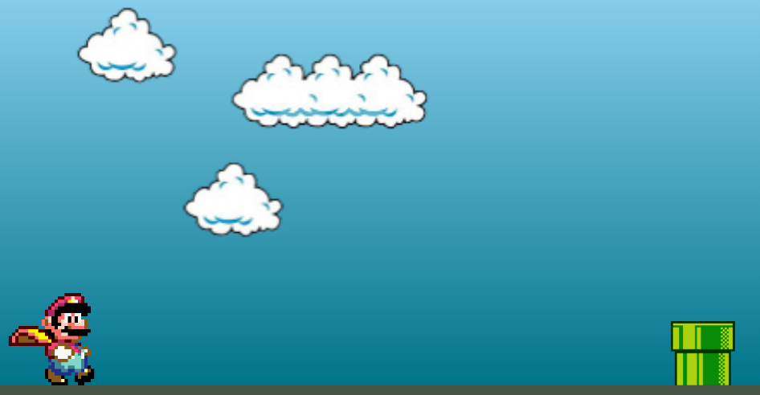

Créditos ao [video de Manual do Dev](https://youtu.be/r9buAwVBDhA) onde ensina a lógica do famoso jogo do Mario em JavaScript.

Este jogo se trada de uma aplicação simples, contruida utililando HTML, CSS e JavaScript para estudo. O projeto consiste em um jogo onde o famoso Mario tem de pular os obstáculos que aparecem no seu caminho, apresentando uma imagem diferente do personagem caso erre o pulo.

